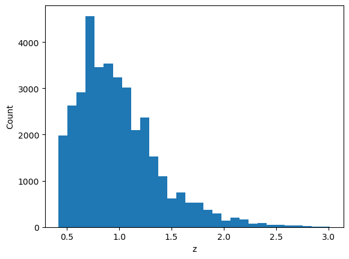
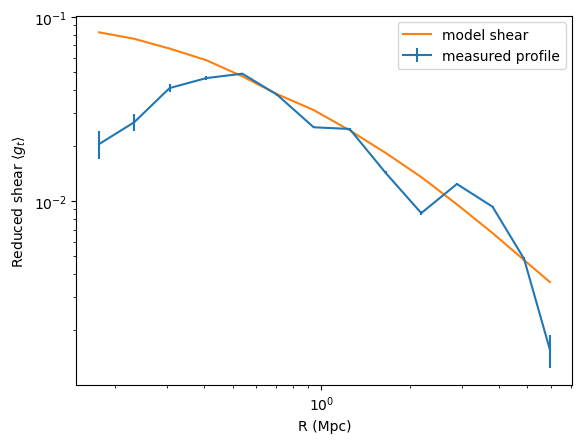

Using the cosmoDC2 catalog
==========================

*Note: this notebook was produced using a previous version of CLMM (v1.5.1)*

Basic usage of the cosmoDC2 extragalactic catalog with CLMM
-----------------------------------------------------------

This notebook can be run at NERSC or CC-IN2P3 where the DESC DC2
products are stored. You need to be a DESC member to be able to access
those.

.. code:: ipython3

    import matplotlib.pyplot as plt
    import numpy as np
    from astropy.table import Table
    import GCRCatalogs
    try: import clmm
    except:
        import notebook_install
        notebook_install.install_clmm_pipeline(upgrade=False)
        import clmm

Check what version we’re using

.. code:: ipython3

    clmm.__version__

.. parsed-literal::

    '1.5.1'

1. Prepare a CLMM GalaxyCluster object from cosmoDC2
~~~~~~~~~~~~~~~~~~~~~~~~~~~~~~~~~~~~~~~~~~~~~~~~~~~~

Read in the extragalactic catalog cosmoDC2
^^^^^^^^^^^^^^^^^^^^^^^^^^^^^^^^^^^^^^^^^^

.. code:: ipython3

    extragalactic_cat = GCRCatalogs.load_catalog('cosmoDC2_v1.1.4_small')

.. code:: ipython3

    # Make a CLMM cosmology object from the DC2 cosmology
    dc2_cosmo = extragalactic_cat.cosmology
    cosmo = clmm.Cosmology(H0 = dc2_cosmo.H0.value, Omega_dm0=dc2_cosmo.Om0-dc2_cosmo.Ob0, Omega_b0=dc2_cosmo.Ob0)
    cosmo

.. parsed-literal::

    <clmm.cosmology.ccl.CCLCosmology at 0x15551392c850>

Get the list of halos with ``M > mmin`` in the redshift range ``[zmin, zmax]``
^^^^^^^^^^^^^^^^^^^^^^^^^^^^^^^^^^^^^^^^^^^^^^^^^^^^^^^^^^^^^^^^^^^^^^^^^^^^^^

.. code:: ipython3

    %%time
    # get list of massive halos in a given redshift and mass range
    mmin = 5.e14 # Msun
    zmin = 0.3
    zmax = 0.4
    
    massive_halos = extragalactic_cat.get_quantities(
        ['halo_mass','hostHaloMass','redshift','ra', 'dec', 'halo_id'],
        filters=[f'halo_mass > {mmin}','is_central==True',
                 f'redshift>{zmin}', f'redshift<{zmax}'])
    N_cl = len(massive_halos['halo_mass'])
    print(f'There are {N_cl} clusters in this mass and redshift range')

.. parsed-literal::

    There are 4 clusters in this mass and redshift range
    CPU times: user 2.26 s, sys: 9.63 s, total: 11.9 s
    Wall time: 1min 54s

Check the units of halo masses in the catalog
^^^^^^^^^^^^^^^^^^^^^^^^^^^^^^^^^^^^^^^^^^^^^

We have filtered the catalog using the ``halo_mass`` field. There are
two related fields in the catalog: ``halo_mass`` and ``hostHaloMass``.
In the `cosmoDC2 preprint <https://arxiv.org/abs/1907.06530>`__, Table 2
in appendix B mentions the halo mass to be in units of
M\ :math:`_{\odot}\; h^{-1}`. However, the `SCHEMA
cosmoDC2 <https://github.com/LSSTDESC/gcr-catalogs/blob/master/GCRCatalogs/SCHEMA.md>`__
mentions M\ :math:`_{\odot}` for ``halo_mass``. Below, we see that
``halo_mass`` equals ``hostHaloMass``/h. So\ ``halo_mass`` is indeed in
units of M\ :math:`_{\odot}`, while ``hostHaloMass`` is in
M\ :math:`_{\odot}\; h^{-1}`.

.. code:: ipython3

    print(f"hostHaloMass:   {massive_halos['hostHaloMass']}")
    print(f"hostHaloMass/h: {massive_halos['hostHaloMass']/cosmo['h']}")
    print(f"halo_mass:      {massive_halos['halo_mass']}")

.. parsed-literal::

    hostHaloMass:   [4.11498904e+14 4.51343114e+14 4.28283670e+14 3.59993019e+14]
    hostHaloMass/h: [5.79575921e+14 6.35694527e+14 6.03216436e+14 5.07032421e+14]
    halo_mass:      [5.79575921e+14 6.35694527e+14 6.03216436e+14 5.07032421e+14]

Below, we use ``halo_mass``.

Select the most massive one
^^^^^^^^^^^^^^^^^^^^^^^^^^^

.. code:: ipython3

    # Selecting the most massive one
    
    select = massive_halos['halo_mass'] == np.max(massive_halos['halo_mass'])
    
    ra_cl = massive_halos['ra'][select][0]
    dec_cl = massive_halos['dec'][select][0]
    z_cl = massive_halos['redshift'][select][0]
    mass_cl =massive_halos['halo_mass'][select][0]
    id_cl = massive_halos['halo_id'][select][0]
    
    print (f'The most massive cluster is halo {id_cl} in ra = {ra_cl:.2f} deg, dec = {dec_cl:.2f} deg, z = {z_cl:.2f}, with mass = {mass_cl:.2e} Msun')

.. parsed-literal::

    The most massive cluster is halo 95600097373 in ra = 64.26 deg, dec = -34.47 deg, z = 0.32, with mass = 6.36e+14 Msun

Apply coordinates, redshift and magnitude cuts to select backgroud galaxies around the cluster
^^^^^^^^^^^^^^^^^^^^^^^^^^^^^^^^^^^^^^^^^^^^^^^^^^^^^^^^^^^^^^^^^^^^^^^^^^^^^^^^^^^^^^^^^^^^^^

-  Box of 0.6 deg around the cluster center
-  Galaxies with z > z_cluster + 0.1
-  Galaxies with mag_i < 25

Here, we’re directly gathering the shear components :math:`\gamma_{1,2}`
and the convergence :math:`\kappa` from the cosmoDC2 catalog. See the
``DC2_gt_profiles`` notebook to see how to also use the intrinsic
ellipticities of the galaxies to compute observed ellipticities
including intrinsic and shear components.

.. code:: ipython3

    %%time
    ra_min, ra_max = ra_cl - 0.3, ra_cl + 0.3
    dec_min, dec_max = dec_cl - 0.3, dec_cl + 0.3
    z_min = z_cl + 0.1
    mag_i_max = 25
    
    coord_filters = [
        'ra >= {}'.format(ra_min),
        'ra < {}'.format(ra_max),
        'dec >= {}'.format(dec_min),
        'dec < {}'.format(dec_max)]
    z_filters = ['redshift >= {}'.format(z_min)]
    mag_filters = ['mag_i < {}'.format(mag_i_max)]
    
    gal_cat = extragalactic_cat.get_quantities(
        ['galaxy_id', 'ra', 'dec', 'shear_1', 'shear_2',
            'redshift', 'convergence'],
        filters=(coord_filters + z_filters + mag_filters))

.. parsed-literal::

    CPU times: user 23.1 s, sys: 25.6 s, total: 48.7 s
    Wall time: 2min 56s

To compute a reduced tangential shear profile using CLMM, we first need to transform the shear into ellipticities.
^^^^^^^^^^^^^^^^^^^^^^^^^^^^^^^^^^^^^^^^^^^^^^^^^^^^^^^^^^^^^^^^^^^^^^^^^^^^^^^^^^^^^^^^^^^^^^^^^^^^^^^^^^^^^^^^^^

-  The CLMM function ``convert_shapes_to_epsilon`` convert any shape
   measurements into the corresponding ellipticities (:math:`\epsilon`
   definition).
-  Then, we build the astropy table of the galaxy catalog that will be
   used to instantiate a CLMM GalaxyCluster object.

.. code:: ipython3

    e1, e2 = clmm.utils.convert_shapes_to_epsilon(gal_cat['shear_1'],gal_cat['shear_2'],\
                                                  shape_definition='shear',kappa=gal_cat['convergence'])
    
    #store the results into an CLMM GCData (currently it's simply an astropy table)
    dat = clmm.GCData(
        [gal_cat['ra'], gal_cat['dec'], e1, e2,
             gal_cat['redshift'], gal_cat['galaxy_id']], 
        names=('ra','dec', 'e1', 'e2', 'z','id'))
    cl = clmm.GalaxyCluster(str(id_cl), ra_cl, dec_cl, z_cl, dat)   

.. code:: ipython3

    # Quick check of the redshift distribution of the galaxies in the catalog
    
    print(f'Number of galaxies in the catalog: Ngal = {len(cl.galcat)}')
    plt.hist(cl.galcat['z'], bins=30);
    plt.xlabel('z')
    plt.ylabel('Count')

.. parsed-literal::

    Number of galaxies in the catalog: Ngal = 36403

.. parsed-literal::

    Text(0, 0.5, 'Count')

2. Use CLMM to compute the reduced tangential shear profile
~~~~~~~~~~~~~~~~~~~~~~~~~~~~~~~~~~~~~~~~~~~~~~~~~~~~~~~~~~~

Compute the tangential and cross shear profiles
^^^^^^^^^^^^^^^^^^^^^^^^^^^^^^^^^^^^^^^^^^^^^^^

NB: Check out the ``demo_dataops`` notebook to see examples of all
available options of the functions below.

.. code:: ipython3

    bin_edges = clmm.dataops.make_bins(0.15, 10, 15, method='evenlog10width') # in Mpc
    cl.compute_tangential_and_cross_components(geometry="flat")
    cl.make_radial_profile("Mpc", bins=bin_edges,cosmo=cosmo, add=True, include_empty_bins=False, gal_ids_in_bins=False)
    pass

3. Sanity check: use CLMM to compute the corresponding NFW model, given the halo mass
~~~~~~~~~~~~~~~~~~~~~~~~~~~~~~~~~~~~~~~~~~~~~~~~~~~~~~~~~~~~~~~~~~~~~~~~~~~~~~~~~~~~~

-  The mass definition used in cosmoDC2 is the friend-of-friend mass
   with linking length b=0.168. In CLMM, the default mass definition is
   :math:`M_{200,m}`: it uses an overdensity parameter
   :math:`\Delta=200` with respect to the matter density. Here, we are
   directly using :math:`M_{\rm fof}` in the modeling functions of CLMM,
   which is inconsistent. However, the goal here is to check that model
   and data are roughly in agreement.
-  The model should take into account the redshift distribution of the
   background galaxies. Here, we simply use the average redshift of the
   galaxy catalog as this is a quick sanity check that things behave as
   expected.
-  For the model, we use a concentration :math:`c = 4`.
-  The error bars on the data computed by ``make_radial_profile`` simply
   corresponds to the standard error of the mean in the bin
   (:math:`\sigma_{\rm bin}/\sqrt{N_{\rm gal\_in\_bin}}`).

.. code:: ipython3

    concentration = 4.
    reduced_shear = clmm.compute_reduced_tangential_shear(cl.profile['radius'], mass_cl, 
                                                          concentration ,z_cl, cl.profile['z'], cosmo,
                                                          halo_profile_model='nfw')  

.. code:: ipython3

    plt.errorbar(cl.profile['radius'],cl.profile['gt'],yerr=cl.profile['gt_err'], label='measured profile')
    plt.plot(cl.profile['radius'],reduced_shear, label='model shear')
    plt.legend()
    plt.xscale('log')
    plt.yscale('log')
    plt.xlabel('R (Mpc)')
    plt.ylabel(r'Reduced shear $\langle g_t\rangle$')

.. parsed-literal::

    Text(0, 0.5, 'Reduced shear $\\langle g_t\\rangle$')

Data and model are in rough agreement at large radii. In the inner
region, the lack of resolution of the DC2 simulations yield an
unphysical attenuation of the signal. This was remarked upon in the
`cosmoDC2 paper <https://arxiv.org/abs/1907.06530>`__ in the context of
galaxy-galaxy lensing.
